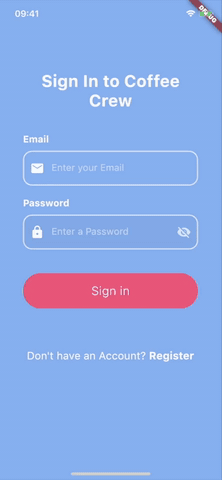
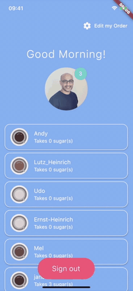

# coffee_crew

A cross platform Flutter app that can be used as a digital order sheet for coffee orders.
Each user can edit their coffee settings dynamically. The data is then updated via a stream.

The project makes extensive use of Flutters explicit Animatations.

The project uses Firebase as a backend (Authentication and Database).

## Versions used
Flutter: 1.17.3
Dart: 2.8.4

  

