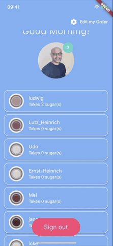

# coffee_crew

An Flutter app that can be used as a digital  estimating effort or complexity. The project is  makes extensive use of Flutters explicit Animatations.

The project uses Firebase as a backend (Authentication and Database).

## Versions used
Flutter: 1.17.3
Dart: 2.8.4

  

